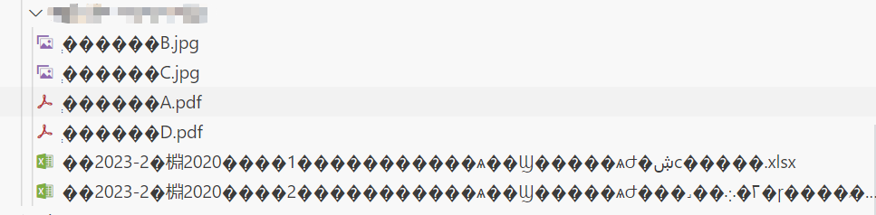

`extract.sh`

调用 `7zip` 工具将`zip`目录内的压缩包解压到`original`下

`folder_process.sh`

有些同学的压缩包内直接就是表格材料，有些压缩包解压还自带文件夹。这个脚本读取`original`文件，统一文件夹层次结构，生成`process_1`。

`fix_gibberish.sh`

有些同学由于解压的格式不对，会生成乱码（如下）

该脚本检测`process_1`中同学表格文件的乱码，并自动修复放在`process_2`内（其他文件的乱码还需要手动调整）。

`fix_name.sh`

有些同学的材料命名是"证明材料B1.jpg"...这个脚本读取`process_2` 把"证明材料"这个前缀去掉统一格式生成 `process_3`。

`folder_process.sh`

读取`process_4` 生成最终的提交的文件结构并移动同学的文件。

`summarize.py`

读取`process_4`汇总同学的表格为一张表格，并检测同学班级的填写，在报错信息中可以看到哪个同学班级填写有误供进一步勘误。这个脚本依赖`folder_process.sh`的文件结构。

